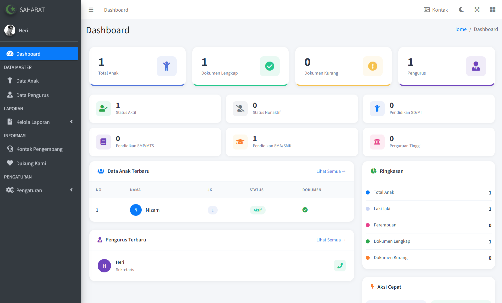
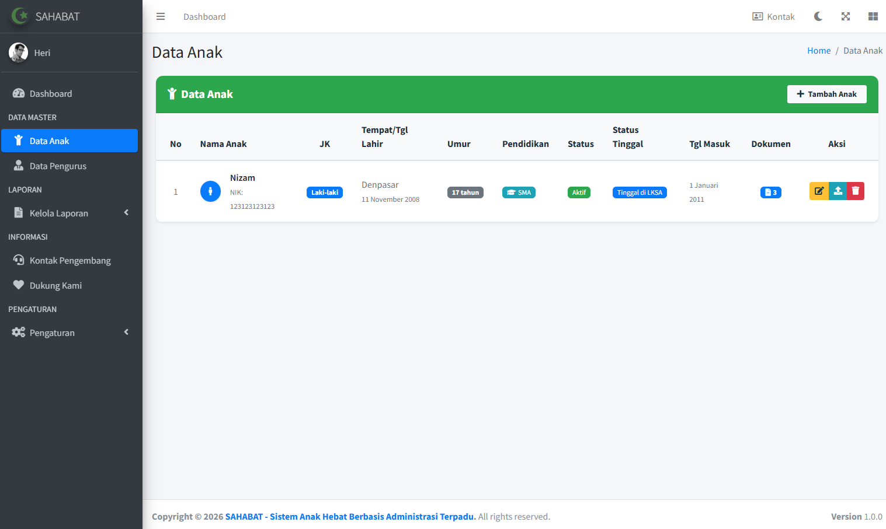
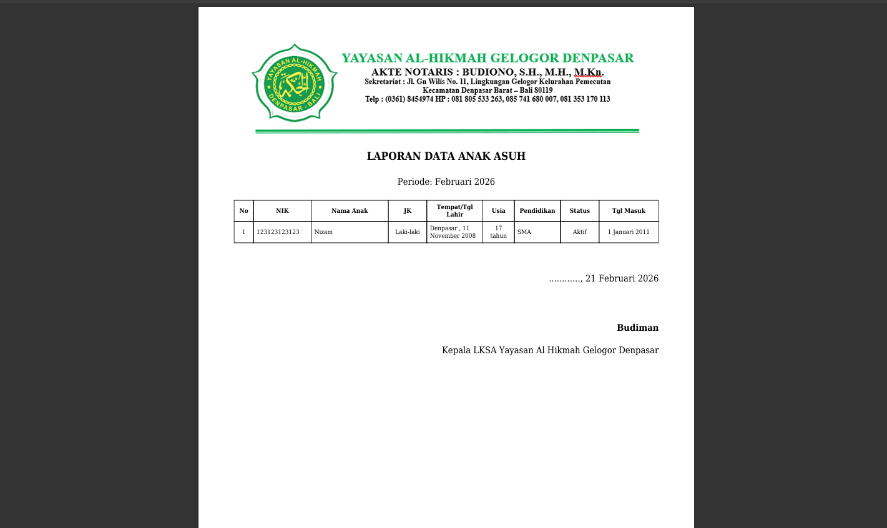
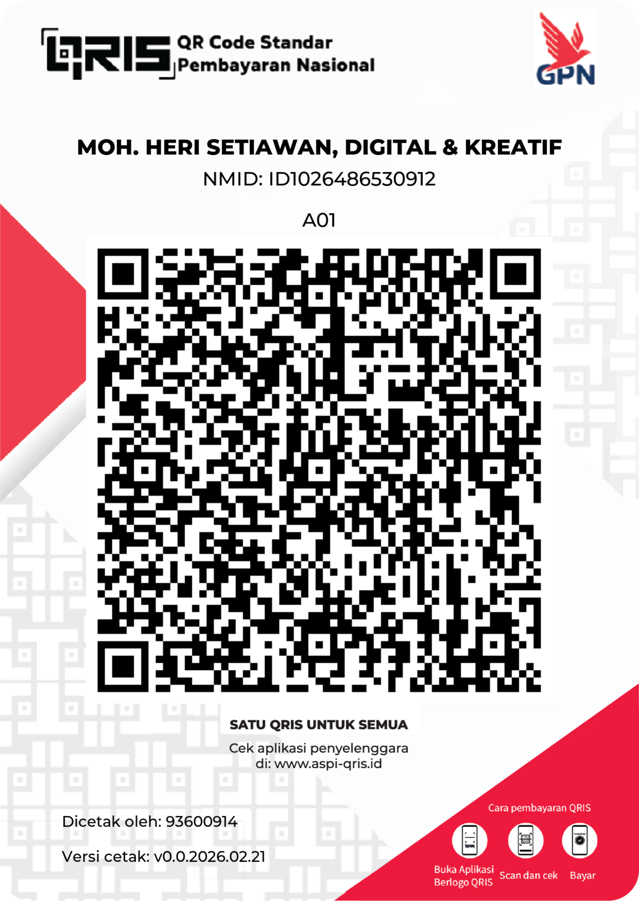

# SAHABAT - Sistem Anak Hebat Berbasis Administrasi Terpadu


SAHABAT adalah sistem informasi berbasis web yang dirancang khusus untuk mengelola data dan administrasi Lembaga Kesejahteraan Sosial Anak (LKSA). Aplikasi ini menyediakan solusi terintegrasi untuk pengelolaan data anak, pengurus, laporan, dan monitoring program kesejahteraan sosial anak.

## 🎯 Fitur Utama

### 📊 Dashboard Interaktif
- Statistik real-time data anak dan pengurus
- Visualisasi data dengan grafik dan chart
- Ringkasan dokumen lengkap/kurang
- Quick actions untuk akses cepat

### 👶 Manajemen Data Anak
- Data lengkap anak (profil, pendidikan, status)
- Upload dan manajemen dokumen (KK, Akta, Pendukung)
- Monitoring status tinggal (Sekolah, Asrama, Perawatan)
- Tracking tanggal masuk dan status aktif/nonaktif

### 👔 Manajemen Data Pengurus
- Data lengkap pengurus dan jabatan
- Upload dokumen KTP
- Manajemen kontak dan informasi

### 📑 Sistem Laporan
- Laporan data anak (PDF & Excel)
- Laporan pengurus
- Laporan dokumen
- Laporan statistik dengan chart (PDF & Excel)
- Export PDF statistik dengan chart sebagai gambar
- Dukungan legend pada chart (jenis kelamin, usia, pendidikan)
- Kop surat yang dapat dikustomisasi

### ⚙️ Pengaturan Sistem
- Profile LKSA (nama, alamat, kontak, logo)
- Manajemen user dan hak akses
- Upload dokumen legal
- Kop surat untuk laporan

### ❤️ Dukung Kami
- Halaman informasi donasi sukarela
- Informasi rekening Bank BSI dan BRI untuk kontribusi
- Tombol copy nomor rekening dengan notifikasi

### 🎨 UI/UX
- Tema AdminLTE 3 dengan Bootstrap 4
- Dashboard clean dan colorful
- Responsive design untuk mobile dan desktop
- Animasi AOS pada landing page
- Font Awesome icons
- Dark Mode support untuk halaman laporan
- Halaman Kontak Pengembang dengan formulir kontak

### 🖼️ Landing Page Dinamis
- Upload gambar hero dan about section dari admin panel
- Fallback otomatis ke gambar Unsplash jika belum ada upload
- Interface admin untuk manajemen gambar landing page
- Optimasi gambar untuk performa website

### 🏢 Manajemen Fasilitas Landing Page
- Halaman admin untuk mengelola fasilitas yang ditampilkan di landing page
- Add, edit, delete fasilitas dengan gambar, deskripsi, dan icon
- Grid display dengan card fasilitas

### 🎠 Kelola Carousel Landing Page
- Halaman admin untuk mengelola gambar carousel hero section
- Upload, edit, delete gambar dengan validasi
- Urutan gambar dapat disesuaikan dan status aktif/nonaktif

### ❤️ Halaman Donasi Landing Page
- Halaman donasi dengan informasi rekening Bank BSI dan BRI
- Fitur copy to clipboard untuk nomor rekening
- QRIS payment dengan kode QR

### 📄 Halaman Lisensi Landing Page
- Informasi lisensi gratis aplikasi SAHABAT
- Kebijakan penggunaan dan persyaratan
- Link ke halaman donasi dan GitHub repository

### 📊 DataTables Server-Side Pagination
- Implementasi pagination server-side untuk performa yang lebih baik
- Untuk halaman Data Anak dan Log Aktivitas
- Filter fungsional dan sorting berdasarkan kolom

### 🔤 Sorting Data Anak berdasarkan Nama
- Data anak diurutkan berdasarkan nama secara ascending secara default
- Konfigurasi sorting di database level

### 📈 Dashboard Substats Update
- Mengganti baris kedua substats dengan Laki-laki, Perempuan, Anak Baru
- Mengganti Pendidikan TK dengan Anak Asrama di baris pertama

### 🎨 Efek 3D pada Sidebar Brand
- Menambahkan text-shadow untuk efek 3D pada teks "SAHABAT"

### 📑 Laporan Ekspor Eksternal
- Laporan data anak untuk keperluan eksternal panti
- Filter berdasarkan status, jenis kelamin, kategori
- Export PDF dan Excel dengan informasi dasar anak

## 🛠️ Teknologi

- **Framework**: CodeIgniter 3.x
- **Bahasa**: PHP 7.4+
- **Database**: MySQL/MariaDB
- **Frontend**: Bootstrap 4, AdminLTE 3, jQuery
- **Library**:
  - DataTables untuk tabel interaktif
  - TCPDF untuk export PDF
  - PHPExcel/PhpSpreadsheet untuk export Excel
  - AOS untuk animasi
  - Font Awesome untuk icon
  - Chart.js untuk visualisasi data
  - Helper tanggal_indo untuk format tanggal Indonesia

## 📋 Prasyarat

- PHP >= 7.4
- MySQL >= 5.7 atau MariaDB >= 10.3
- Web Server (Apache/Nginx)
- Ekstensi PHP: mysqli, gd, mbstring, zip

## 🚀 Instalasi

1. **Clone atau download repository**
   ```bash
   git clone https://github.com/username/sahabat.git
   cd sahabat
   ```

2. **Import database**
   ```bash
   mysql -u username -p database_name < database/db_lksa.sql
   ```

3. **Konfigurasi database**
   - Buka `application/config/database.php`
   - Sesuaikan pengaturan koneksi database

4. **Konfigurasi base URL**
   - Buka `application/config/config.php`
   - Sesuaikan `$config['base_url']`

5. **Atur permission folder**
   ```bash
   chmod 755 -R assets/uploads/
   chmod 755 -R assets/uploads/landing/
   chmod 755 -R application/cache/
   chmod 755 -R application/logs/
   ```

6. **Akses aplikasi**
   - Buka browser dan akses URL instalasi
   - Login default: admin/admin

## 📁 Struktur Folder

```
sahabat/
├── application/
│   ├── config/         # Konfigurasi aplikasi
│   ├── controllers/    # Controller (Admin, Auth, Landing)
│   ├── models/         # Model (Anak_model, Pengurus_model, User_model)
│   ├── views/          # View (admin/, templates/, landingpage/)
│   └── helpers/        # Helper functions
├── assets/
│   ├── css/            # Stylesheet
│   ├── js/             # JavaScript
│   ├── img/            # Gambar default
│   ├── uploads/        # Upload folder (logo, dokumen, landing images)
│   │   ├── logos/      # Logo LKSA
│   │   ├── documents/  # Dokumen legal
│   │   ├── kop/        # Kop surat
│   │   ├── landing/    # Gambar landing page (hero, about)
│   │   └── foto_anak/  # Foto anak
│   ├── plugins/        # Third-party plugins
│   └── landing/        # Landing page assets
├── database/
│   └── db_lksa.sql     # Database schema
├── system/             # CodeIgniter system
└── index.php          # Entry point
```

## 👤 Default Login

- **Username**: admin
- **Password**: admin

> ⚠️ **Penting**: Ganti password default setelah login pertama kali!

## 📱 Screenshot

### Dashboard Admin


### Data Anak


### Laporan PDF


## 🤝 Kontribusi

Kontribusi selalu diterima! Untuk berkontribusi:

1. Fork repository
2. Buat branch fitur (`git checkout -b fitur-baru`)
3. Commit perubahan (`git commit -am 'Tambah fitur baru'`)
4. Push ke branch (`git push origin fitur-baru`)
5. Buat Pull Request

## ❤️ Dukungan

Jika Anda ingin mendukung pengembangan aplikasi SAHABAT, donasi dapat disalurkan melalui:

**Bank BSI**: 7252957170  
**Atas Nama**: Moh. Heri Setiawan

**Bank BRI**: 057201014816537
**Atas Nama**: Moh. Heri Setiawan

### QRIS


Setiap dukungan akan membantu peningkatan fitur dan keberlanjutan layanan.

## 📝 Lisensi

Aplikasi ini dilisensikan di bawah [MIT License](LICENSE).

## 📧 Kontak

- **Email**: info@sahabat-lksa.id
- **Website**: https://sahabat-lksa.id
- **Developer**: Moh. Heri Setiawan

---

<p align="center">
  <strong>SAHABAT - Sistem Anak Hebat Berbasis Administrasi Terpadu</strong><br>
  Dibuat dengan ❤️ untuk kesejahteraan anak Indonesia
</p>
